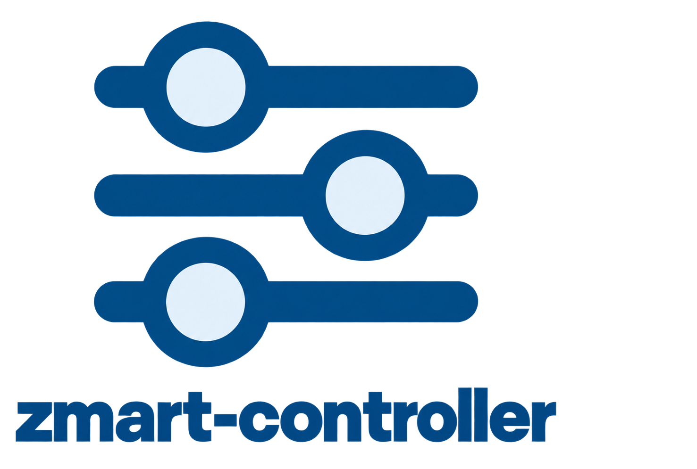
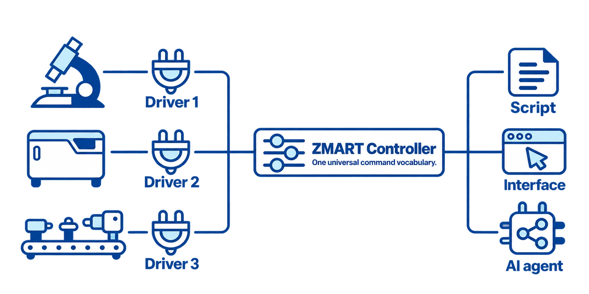

# ZMART Controller

[](https://www.python.org/downloads/)
[](LICENSE)
[](pyproject.toml)
[](#testing)
[](#status)



The **ZMART Controller** provides a small, universal schema for driving a microscope from Python.
If you write your workflow with its commands, the workflow runs on any microscope that has a ZMART driver plugged into it.
It is part of [**ZMART**](https://github.com/thomdehoog/ZMART-microscopy) (ZMB's Microscopy-Agnostic Research Toolkit), the tools we are building for smart microscopy
at the Center for Microscopy and Image Analysis (ZMB), University of Zurich.
<br clear="left"/>

## The Problem

Every microscope comes with its own programming interface, so a workflow that is built for one microscope
does not work on another. This is a real obstacle to sharing our workflows and deploying them on all the microscopes we want.


## The Solution

The ZMART controller lives between your workflow and the microscope:

1. **One universal interface.** A short list of plain commands to move in xyz,
   get and set the state of the microscope, and acquire an image.

2. **A schema, not a driver.** It provides a consistent, interoperable vocabulary
   that ZMART-drivers plug into. The drivers take care of interacting with the microscope, enforcing limits,
   and providing a single absolute coordinate system that corresponds to the space in which you observe the specimen.

Note: we are aware of the [useq-schema](https://github.com/pymmcore-plus/useq-schema) from the Micro-Manager community and of Anthropic's [Model Hardware Standard](https://www.anthropic.com/news/model-hardware-standard-research-preview). We might switch, because both have real upsides, but currently the useq-schema is not interoperable enough for our needs and the Model Hardware Standard is not released to the public yet.
<p align="center">
  
</p>

### The vocabulary

Everything you can say to a microscope:

```python
import zmart_controller

# 1) See which microscopes are available, and connect to one
zmart_controller.get_instruments()
zmart_controller.set_instrument(instrument=Dict)

# 2) Learn about the connected setup: where images go, and the microscope in plain words
zmart_controller.get_info()

# 3) Discover the motors, then read the position and travel range, or move (micrometers)
zmart_controller.get_actuators()
zmart_controller.get_xyz()
zmart_controller.set_xyz(x, y, z, with_actuators=Dict)

# 4) Capture the instrument settings, and apply them again later
zmart_controller.get_state()
zmart_controller.set_state(Dict)

# 5) Capture and save an image with the current settings and position
zmart_controller.get_acquisition_options()
zmart_controller.acquire(acquisition_type=String, position_label=String, options=Dict)

# 6) Run a routine the microscope offers (for example autofocus)
zmart_controller.get_procedures()
zmart_controller.run_procedure(Dict)

# 7) Close the connection
zmart_controller.disconnect()
```

Every command except `disconnect` answers with the same two things:

```python
{"success": True, "report": {...}}
```

`success` says whether the driver did what you asked. `report` is whatever the
driver has to say about it: a position, a saved-file record, a state. When
something unexpected happens, the answer is `success: False`, and the details are in `report`.
We have not defined a vocabulary for error messages at this point.


## Try it yourself

 - [Install it and run your first experiment on the mock driver](docs/first-experiment.md)
 - [Install it and register your microscopes](docs/setup.md)
 - [Plug in your own driver functions](docs/driver.md)

### Status
This is version 0.1. We do not use it daily yet, because our smart-microscopy workflows are not
in routine use. Today it is the layer between our workflows and the Leica Stellaris: the workflow
speaks the controller's commands, and the Stellaris driver turns them into actions on the microscope.
Drivers for other microscopes exist in ZMART Microscopy, and each says there how far it has been
validated. They are being moved to the layout this controller plugs in (a `zmart.json` beside the
driver's functions, see [Plug in your own driver functions](docs/driver.md)). Until a driver has made
that move, the mock driver in `tests/mock_zmart_driver/` is the one you can plug in directly.

## Testing

The tests run on the mock driver, so they need no microscope. From a clone of this repository:

```bash
pip install -e ".[test]"
python -m pytest
```

The mock driver also has a check of its own, which runs its tests and a style check
(it needs `pip install ruff`):

```bash
python tests/mock_zmart_driver/testing/run_ci.py
```

## Author
Thom de Hoog, Center for Microscopy and Image Analysis (ZMB), University of
Zurich (thom.dehoog@zmb.uzh.ch, thomdehoog@gmail.com).

## License
MIT License. See LICENSE file for details.

## Links

- [ZMART Microscopy](https://github.com/thomdehoog/ZMART-microscopy): the main repository, with the workflows and the drivers
- [ZMART drivers](https://github.com/thomdehoog/ZMART-microscopy/tree/main/zmart_drivers): the drivers that plug into this controller, one per microscope
- [ZMART analysis](https://github.com/thomdehoog/ZMART-analysis): the analysis engine that runs between acquisitions
- [ZMART viewer](https://github.com/thomdehoog/ZMART-viewer): the viewer
- [Center for Microscopy and Image Analysis (ZMB)](https://www.zmb.uzh.ch), University of Zurich
